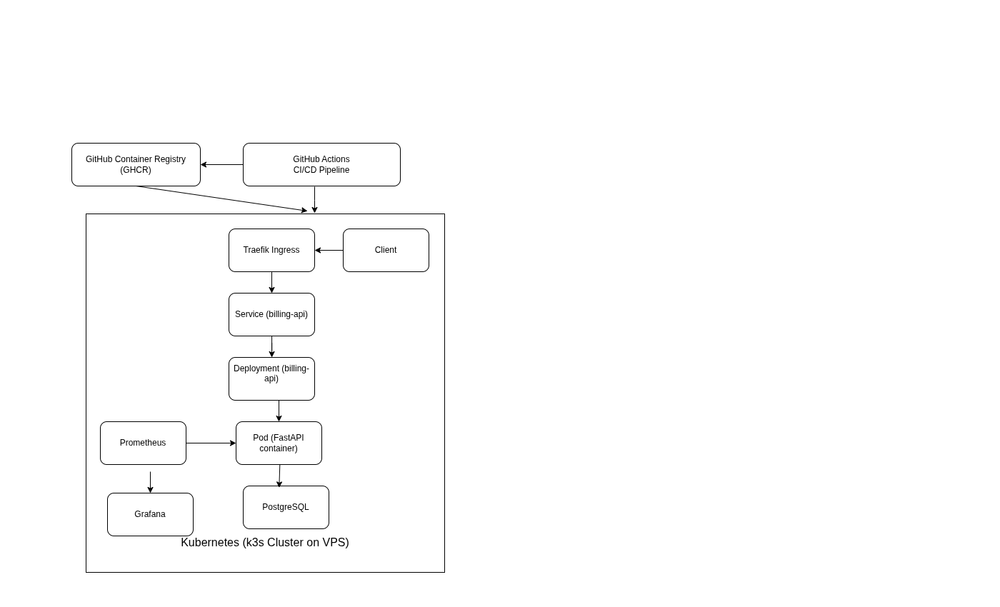
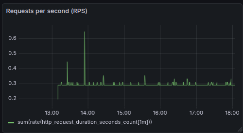
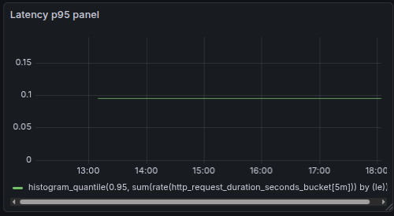

# Billing API

A subscription-based billing backend built with **FastAPI** and
**PostgreSQL**, designed with production-ready deployment and
observability in mind.

------------------------------------------------------------------------

## 🚀 Live Demo

Swagger UI\
http://82.165.138.175/docs

Health check\
http://82.165.138.175/health

------------------------------------------------------------------------

# 🧱 Architecture Overview

The application runs on a Kubernetes (k3s) cluster with automated CI/CD
and full observability.

## 📐 Architecture Diagram

### Flow Explanation

1.  Code push triggers **GitHub Actions**
2.  Docker image is built and pushed to **GHCR**
3.  Kubernetes pulls the image and performs a rolling update
4.  Traffic flows:
    -   User → Traefik Ingress
    -   Ingress → Service
    -   Service → Deployment → Pod
    -   Pod → PostgreSQL (StatefulSet + PVC)
5.  Prometheus scrapes `/metrics` via ServiceMonitor
6.  Grafana visualizes metrics from Prometheus

------------------------------------------------------------------------

# 📊 Monitoring & Observability

The application exposes Prometheus metrics at:

    /metrics

Prometheus discovers the service via a **ServiceMonitor** resource and
collects request and latency metrics.

## 📸 Grafana Dashboard Screenshots

### Requests per Second (RPS)

### p95 Latency

These dashboards visualize real-time traffic and performance signals
from the running Kubernetes cluster.

------------------------------------------------------------------------

# 🔁 CI/CD Pipeline

On every push:

1.  Docker image is built
2.  Image is pushed to GitHub Container Registry
3.  Kubernetes deployment is updated
4.  Rolling update is triggered automatically

Deployment is fully automated without manual server access.

------------------------------------------------------------------------

# 🧱 Tech Stack

Backend: - Python 3.12 - FastAPI - SQLAlchemy - Pydantic

Database: - PostgreSQL - Alembic

Infrastructure & DevOps: - Docker - GitHub Actions - GitHub Container
Registry - Kubernetes (k3s) - Traefik Ingress - Prometheus - Grafana

------------------------------------------------------------------------

# 🗂️ Domain Model

-   Customer
-   Plan
-   Subscription
-   Invoice

A subscription links a customer to a plan and automatically generates
invoices per billing cycle.

------------------------------------------------------------------------